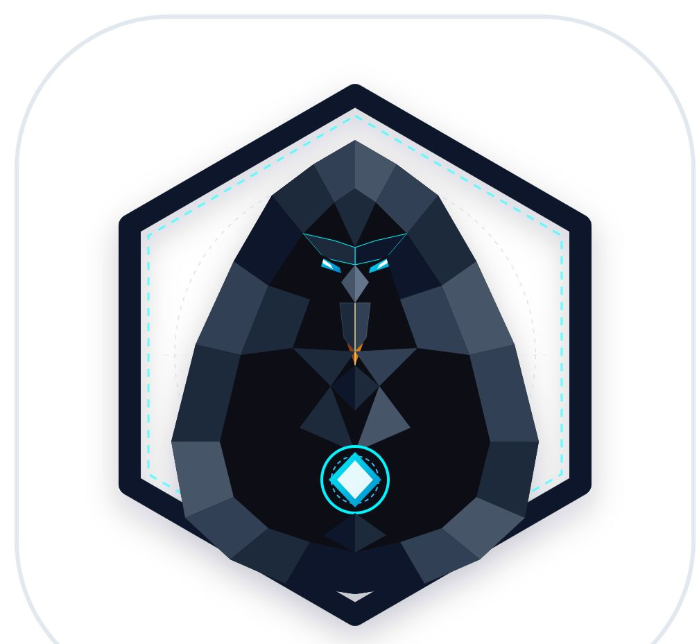
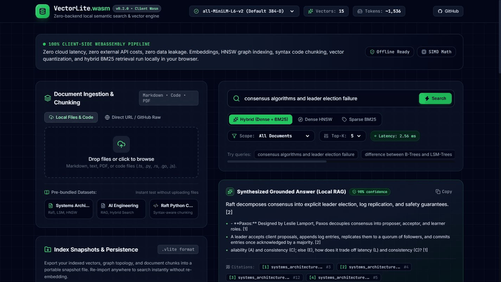
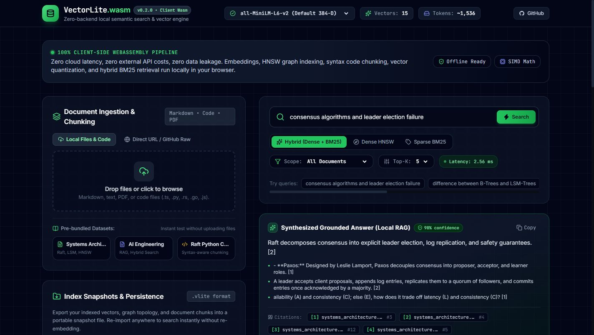
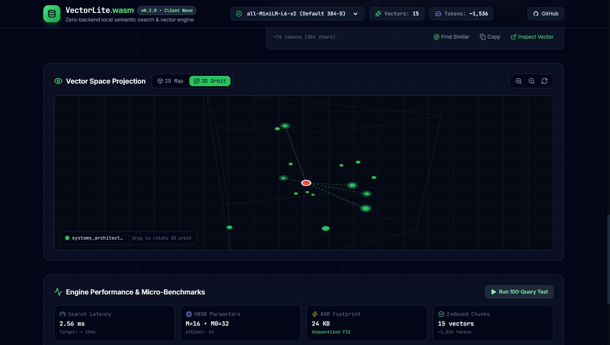
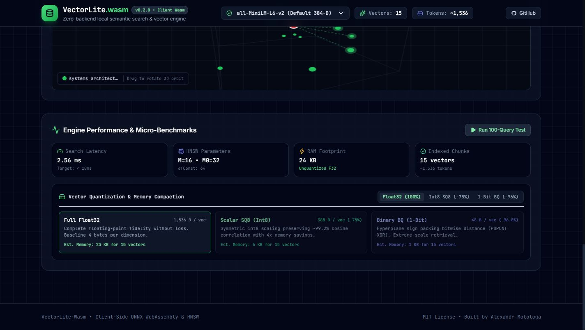

<p align="center">
  <picture>
    <source media="(prefers-color-scheme: dark)" srcset="docs/images/logo.svg">
    
  </picture>
</p>

<h1 align="center">VectorLite-Wasm</h1>

<p align="center">
  <strong>Client-side vector search and semantic retrieval engine running entirely inside the browser via WebAssembly, HNSW, and Web Workers.</strong>
</p>

<p align="center">
  
  
  
  
  
</p>

---

VectorLite-Wasm is an in-browser vector search engine and semantic document retrieval system. It runs entirely inside the browser through WebAssembly and Web Workers, executing quantized transformer models (ONNX Runtime Web) alongside an in-memory Hierarchical Navigable Small World (HNSW) index, Okapi BM25 lexical search, vector quantization, and local grounded RAG.

No document text or vector embeddings are transmitted to external servers.

---

## Interactive Demo

<p align="center">
  
</p>

## Visual Studio & Architecture

### Ingestion, Semantic Search & Local Grounded RAG


### 3D Orbital Vector Space Projection (Fast PCA)


### In-Memory Benchmarks & Quantization Telemetry (SQ8 & 1-Bit BQ)


---

```
                  +----------------------------------------------+
                  |               Browser Window                 |
                  |                                              |
Document Drop --->|  [Recursive & Syntax-Aware Code Chunker]     |
                  |          |                                   |
                  |          v (Batch Text / Code Chunks)        |
                  |  [Web Worker: ONNX Runtime Web]              |
                  |          |                                   |
                  |          v (384-D Float32 / Quantized SQ8)   |
                  |  +----------------------------------------+  |
                  |  |  In-Memory Hybrid Storage              |  |
                  |  |  - HNSW Index (Dense Cosine Graph)     |  |
                  |  |  - BM25 Index (Sparse Inverted Index)  |  |
                  |  |  - Predicate Metadata Filter Engine    |  |
                  |  |  - IndexedDB Persistence Store         |  |
                  |  +----------------------------------------+  |
                  |          |                                   |
User Query ------>|  [Reciprocal Rank Fusion Engine]             |
                  |          |                                   |
                  |          +---> [Local RAG Synthesizer]       |
                  |          |                                   |
                  |          v                                   |
                  |  [Ranked Matches & 3D Orbit Cluster Canvas]  |
                  +----------------------------------------------+
```

## Features

- **Zero Network Transmission:** All embedding generation, vector distance calculations, and graph routing occur inside the browser.
- **Hierarchical Navigable Small World (HNSW):** Logarithmic graph-based approximate nearest neighbor search with configurable `M` (connections per node), `M0`, and `efConstruction`.
- **Hybrid Search with Reciprocal Rank Fusion (RRF):** Blends dense semantic embeddings with sparse BM25 term frequency scores to handle conceptual meaning and exact identifiers equally well.
- **Multi-Model Selector:** Switch between `all-MiniLM-L6-v2` (fast 384-D), `bge-small-en-v1.5` (high-accuracy retrieval), and `multilingual-e5-small` (100+ languages) on the fly.
- **Metadata & Document Scoping Filter:** Scope searches to specific documents or metadata attributes while preserving HNSW logarithmic routing speed.
- **Find Similar (Query-by-Example):** Retrieve nearest neighboring chunks using a stored chunk's vector embedding without generating new query embeddings.
- **Vector Quantization:** Scalar Quantization SQ8 (Int8 symmetric scaling for 75% RAM reduction) and 1-bit Binary Quantization (BQ bit-packing for 96.8% RAM reduction).
- **Syntax-Aware Code Chunker:** Preserves functions, classes, interfaces, and struct blocks intact for Python, TypeScript, Rust, Go, JavaScript, and JSON.
- **Direct URL & GitHub Raw Ingestion:** Fetch and index public documents and source code repositories directly via raw HTTPS endpoints.
- **Local Grounded RAG:** Synthesizes direct natural language answers with bracketed citation markers `[1]`, `[2]` linking back to retrieved evidence chunks.
- **3D Orbital Cluster Map:** Interactive 3D vector cluster projection on Canvas using fast power-iteration PCA with mouse drag rotation and elevation controls.
- **Index Snapshot Export (`.vlite`):** Saves the complete graph topology, vector weights, and chunk texts to a portable JSON file for instant re-import without re-embedding.
- **IndexedDB Persistence:** Automatically preserves chunks and vectors across page reloads.

## Quick Start

### Prerequisites

- Node.js 18 or higher
- npm 9 or higher

### Installation

```bash
git clone https://github.com/alexandrmotologa/vectorlite-wasm.git
cd vectorlite-wasm
npm install
```

### Development Server

```bash
npm run dev
```

Open `http://localhost:5173` in your browser.

### Production Build

```bash
npm run build
npm run preview
```

### Run Automated Tests

```bash
npm test
```

## Architecture & Search Mechanics

### Dense HNSW Index

The engine implements an in-memory multi-layer proximity graph based on the Malkov-Yashunin formulation:

1. Upper layers contain long-range connections for fast greedy routing toward the query neighborhood.
2. Layer 0 contains a dense graph bounded by degree `M0 = 2 * M` for fine-grained nearest neighbor selection.
3. Cosine distances between normalized `Float32Array` vectors are computed using 4-step loop unrolling to optimize CPU cache lines.

### Hybrid Retrieval (RRF)

Dense vector search can miss exact code names or specific variables, while lexical search can miss conceptual synonyms. VectorLite combines both using Reciprocal Rank Fusion:

$$RRF(d) = \sum_{m \in M} \frac{w_m}{k + r_m(d)}$$

Where $k = 60$, $r_m(d)$ is the rank in model $m$, and $w_m$ is the modality weight.

### Vector Quantization

- **Scalar Quantization (SQ8):** Compresses 32-bit floats into signed 8-bit integers (`Int8Array`) using absolute maximum dynamic scaling. Reduces memory from 1,536 bytes to 388 bytes per 384-dimensional vector while maintaining >99% cosine correlation.
- **Binary Quantization (BQ):** Converts dimensions to 1-bit binary representations based on sign ($v_i > 0 \to 1$, $v_i \le 0 \to 0$), packing 384 dimensions into 48 bytes. Computes Hamming distance via bitwise XOR and hardware POPCNT.

### Local Grounded RAG

Extracts high-salience factual sentences from the top retrieved chunks, removes redundant phrasing, and assembles a concise summary with numbered citations `[1]`, `[2]` pointing to original source excerpts.

## Project Structure

```
vectorlite-wasm/
├── docs/
│   ├── images/              # Architecture diagrams, logos, and screenshots
│   └── API.md               # API documentation for engine modules
├── public/
│   └── samples/             # Pre-bundled technical datasets & code files
├── src/
│   ├── components/          # React UI components (Radar, Search, Dropzone, RAG, Benchmarks)
│   ├── engine/              # Core standalone modules
│   │   ├── bm25.ts          # Okapi BM25 lexical engine
│   │   ├── chunker.ts       # Recursive markdown text splitter
│   │   ├── code_chunker.ts  # Syntax-aware code chunker
│   │   ├── hnsw_index.ts    # HNSW graph indexing & search
│   │   ├── hybrid.ts        # Reciprocal Rank Fusion combiner
│   │   ├── pca.ts           # Online PCA 2D & 3D cluster projector
│   │   ├── pdf_loader.ts    # Client-side PDF text extractor
│   │   ├── quantization.ts  # SQ8 and BQ vector quantization
│   │   ├── rag_synthesizer.ts # Local grounded RAG answer generator
│   │   ├── similarity.ts    # Unrolled SIMD-friendly vector math
│   │   ├── snapshot.ts      # .vlite snapshot export/import
│   │   └── storage.ts       # IndexedDB storage layer
│   ├── workers/             # Web Worker running ONNX Runtime Web
│   ├── App.tsx              # Main application shell
│   └── index.css            # Tailwind & custom glow styles
├── tests/                   # 7 Vitest test suites (16 unit tests)
└── vite.config.ts           # Vite configuration with Wasm headers
```

## License

MIT License. Built with ❤️ by Alexandr Motologa.
